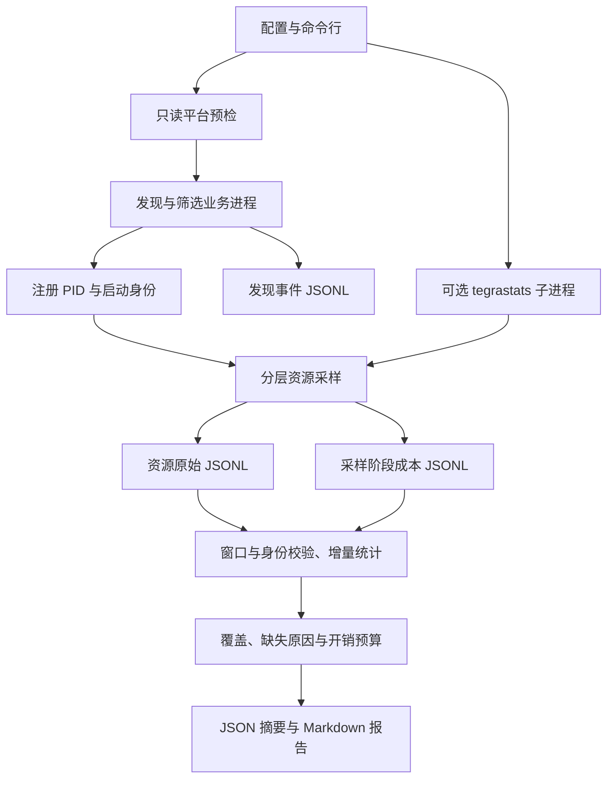

# 通用平台采集架构与实现思路

目标是同一套工具在 Orin/Thor 上获得可信的系统、进程和线程基线。平台差异由能力检测处理，业务部署差异由配置处理。设备型号不决定算法名称，也不能保证全部指标可读。工具不修改功耗、频率、调度策略，不重启现有业务。

## 数据与控制流

`monitor` 观察已运行的业务；`runner` / `suite` 启动并拥有测试负载。两种入口复用资源采样和分析，生命周期责任不同：业务进程只读；工具启动的负载、采样线程、可选遥测子进程由工具负责回收。

## 模块分工

| 模块 | 职责 | 不能据此推断 |
| --- | --- | --- |
| `platform_probe.py` | 记录型号、内核/系统、接口存在性与读取结果及工具发现 | 有可执行文件不等于工具可用；平台识别不等于认证 |
| `discovery.py` | 当前用户、活动阈值、名称/PID、排除项、cgroup 与数量限制 | 活跃候选不等于算法识别；组件容器的一个PID不等于一个节点 |
| `monitor.py` | 定期发现、注册/注销、发现成本与报告 | 没发现目标不等于没有业务 |
| `resources.py` | 单采样线程、独立采样周期、线程选择、计数增量与成本分析 | 累计等待不等于单次调度原因；采样峰值不等于真实峰值 |
| `jetson.py` | 可选 tegrastats、原始接收记录、格式解析与陈旧判断 | EMC 活动百分比不等于 GB/s；GPU利用率不等于推理耗时 |
| `runner.py` / `suite.py` | C01/S01 合成基线、重复实验、ABBA 开销对照 | 合成负载不等于真实机器人端到端链路 |

## 为什么分层采样

旧行为让系统、进程、每个线程按相同周期读取。线程很多时，线程枚举和多次 procfs 读取成为主要成本。现在各层可设独立周期，默认仍沿用原来的基础周期；推荐业务模板使用系统/进程0.5秒、线程2秒。这是可调整的起点，尚不是设备校准参数。

每个资源快照有总采集区间，实际执行的来源另有 `source_windows`。未到期的层不复用旧值，也不记为读取失败。分析只在同一身份的相邻有效观测之间计算增量；实际读取失败、进程/线程消失、计数器重置会中断或拒绝相应增量。

PID 用注册编号和启动时刻固定身份；TID 再加线程启动时刻。线程独立采样时验证父进程身份，避免跨重启拼接。先按TID筛选可避免被排除线程的读取；名称筛选仍需先读线程名称，所以成本通常高于TID筛选。名称来自 Linux comm，通常只有15个可见字符，可能与ROS名称不同。

发现与采样按绝对期限安排。一次处理过慢会跳过已错过的期限，不补发一串采样。覆盖统计展示各层实际次数、跨度、最大间隔与耗时。筛选/关闭线程降低了观测范围，报告保留选择规则和省略计数；`selection.sampled` 是已尝试读取的线程数，失败原因另外保留。

## 开销与质量口径

- `collection_cost`：采集、编码、资源写入/flush的计数、均值、最大耗时与超周期次数；成本日志自身写入不在这项计时内，不能视为完整周期上界。
- `observer`：整个采集进程的CPU增量，包含发现、采样、编码、日志和遥测读取线程；不包括独立的 tegrastats 子进程CPU。
- `observer.total_cpu_percent_one_core`：采集进程与自有遥测子进程在共同有效观测区间内的CPU。子进程用PID和启动时刻校验，身份变化、计数重置和读取缺失不跨接；开启遥测但缺少子进程CPU时，总开销预算无法评估。原有 `cpu_percent_one_core` 保留父进程口径，旧日志仍可读取。
- `phase_thread_cpu_ns`：当前执行线程的阶段CPU成本，与阶段墙钟耗时分别统计；不把并行发现线程的CPU计入采样阶段。发现摘要分别列出读取、选择/注册、编码、写入的墙钟与线程CPU成本。
- `overhead_budget`：预算默认null。配置后可得到未配置、无法评估、超出或观测范围内的状态。观测范围内不代表业务无扰动，也不是套件中的ABBA结论。
- `availability` / 遥测逐项可用性：缺失为null并带原因，零值保持为零。权限、BSP接口缺失、schedstats开关、陈旧遥测与真实零值分别解释。
- `source_coverage`：采集次数不等于有效CPU区间，进程CPU是否有有效区间还需检查实体指标；质量不足会提示复核。

成本统计不保留全部样本在内存中，也不冒充P95。原始成本JSONL可用于后续离线分布分析。慢磁盘和大范围线程读取仍可能拖慢采集；有界遥测缓冲不限制磁盘输出总量，长时间运行应预留存储空间。

## 同覆盖采集优化

发现仍枚举当前PID命名空间。先读身份和UID，再应用硬范围条件；范围外的对象不继续读取exe等详情。只有活动阈值为0且没有名称纳入规则时，才采用明确PID范围；名称、PID与活动发现的并集语义保持。`scan.scope_filtered_count` 及原因区分配置过滤和读取失败，`candidate_count` 仍是可见数字PID项数。范围过滤后的 `process_count` 是详细校验通过的对象数；`eligible_count` 是交给选择器的范围内对象数。对象离开范围后不保留CPU活动历史，重新进入时需重新建立活动观测，显式PID或名称仍可立即触发选择。

进程/线程缓存只存文件路径，不缓存动态计数器、不持有打开的文件描述符；每次该来源采集后替换为本轮路径集合，死亡对象和被移除的注册对象随下一轮相应采集清除。每轮线程枚举、身份校验仍执行。名称筛选复用本轮首次stat读取，并在第二次stat验证身份和名称，减少重复读取。

发现路径在同一proc根目录内复用，UID、身份、cgroup及CPU每轮重读。线程使用scandir枚举数字TID，已知TID复用文件路径，排序和失败记录口径保持。可选 `cgroup_prefilter` 在详细读取前检查硬cgroup条件，默认关闭；匹配对象最终重读范围与身份，早读失败回退。此阶段没有直接枚举服务的 `cgroup.procs`，避免在尚未验证的v1/v2、挂载点和namespace上假定完整候选范围。路径复用减少构造操作，是否降低总CPU必须由设备同覆盖对照验证。

sysfs接口清单及静态标签每5秒刷新一次；频率、温度、功率等数值每个系统采样周期重新读取。接口消失时当前读取立即返回null和原因，新接口及标签变化最迟在下一次满足刷新期限的系统采样发现。接口清单更新时间写入 `system.interface_inventory`。不自动调低采样频率，不修改业务调度或平台设置，不引入额外运行依赖或写入线程。

JSONL采用紧凑编码，字段和schema1继续兼容；新增观测字段为可选。相同业务、范围、周期下才比较优化收益。`tests/integration_collector_optimization.py` 提供三批交替顺序的49线程同覆盖验证；减少线程范围或降低频率的配置实验单独解释。Docker开发结果不能代替Orin/Thor设备验收。

## Jetson 遥测设计

默认关闭。开启后只启动自己的一份 `tegrastats --interval ...`，排除该子进程的业务发现，退出时只回收它；不会调用全局 `tegrastats --stop`。工具不存在、读取失败、提前退出或输出陈旧时，基础采样继续运行，遥测保留不可用原因。

解析显式 GPU 活动、GPU频率（多个GPC分别记录）、EMC活动百分比和EMC频率。原始行使用本机单调时钟接收时间；这个时间不是设备生成时间。每个遥测样本有编号，摘要去重且只纳入窗口内接收到的新鲜数据，部分字段缺失保留逐项原因。精确内存带宽、GPU推理时长和业务事件关联尚未实现。

读端只保留最新解析值；单行缓冲上限64KiB，超长行丢弃并计数，stderr单独落盘。Python运行仍仅依赖标准库。

## 在不同设备上具体改什么

1. **先确认平台**：在设备运行短采集，检查 `environment.json` 的实际内核、Jetson家族、可读能力与权限；实际业务的ROS/RMW另外确认，runner环境记录提供其ROS_DISTRO/RMW配置。不要仅比较Ubuntu版本。
2. **再确定业务范围**：检查 `discovery.jsonl` 的依据；通过名称/PID、用户、排除和cgroup修正。空闲GPU工作进程宜显式纳入。无需修改采样代码。
3. **调整观测粒度**：先用低频线程模板，再对关注进程/线程提高频率。短命线程与很短的调度等待可能被采样漏掉。
4. **建立第一阶段基线**：固定业务输入、版本、功耗/散热状态；分别跑无采集、采集对照与足够多次重复。预算由允许的业务影响决定。
5. **开展第二阶段优化**：依据证据一次改变一个因素，例如线程绑定、优先级、执行器、QoS或通信策略；在相同条件下复测。工具不自动修改这些设置。
6. **深入真实链路**：使用已整理的官方/开源工具参考，为ROS回调关联tracing，为GPU活动关联Nsight，为内核等待关联perf/RTLA。真实消息类型、回调与期限按应用补配置或插桩。

本次已完成前三步所需的通用采集能力；第四至第六步需要目标设备和真实业务条件，不以容器自测代替。

## 原生构建与执行证据

`EP_BUILD_ROS=OFF` 只构建独立Linux周期任务；native入口先检查展开后的场景，含C01才加载ROS并构建通信程序。runner只要求实际用到的二进制，S01不要求遗留的ros_bench。新运行的environment记录所用二进制SHA256；直接Python入口没有外部host档案时，在启动时采集当前进程可见的平台视图，并标明来源。容器内的此视图不能冒充容器外宿主档案；已有日志不补写。

测试进程的生命周期与业务monitor分离：测试仅认领自己创建的根进程和经过完整亲缘/身份/角色验证的后代。Linux集成辅助器使用pidfd发信号、固定proc目录描述符读取已验证角色的参数，不依赖可选的 `/proc/.../children`。创建fixture前要求默认SIGCHLD，拒绝继承的忽略或自定义处理器；在CPython/Linux主线程重新安装默认处理器清除自动回收标志。根注册必须紧随Popen且没有并发poll/wait、其他reaper或信号处理变化；[pidfd创建者身份保证的前提](https://man7.org/linux/man-pages/man2/pidfd_open.2.html)需始终满足。部分初始化失败保留创建者回收责任，发现明确身份变化则不向该pidfd发信号。无法安全回收时测试失败，不使用裸PID或进程组回退。该辅助器仅用于测试，monitor始终不认领或发送信号给外部业务。
