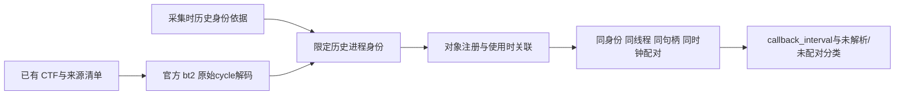

# ROS tracing 离线回调分析

此入口读取**已有** ROS CTF，不创建 LTTng 会话、不加载 SDK、不启用生产追踪或读取当前进程身份。采用官方 Babeltrace Python `bt2` 解码，标准库分析层独立处理身份、对象关系和回调配对。源码脚本不包含在 0.8.1 wheel 内，18 个 perfkit 模块及业务事件契约保持不变。

已在隔离的原生 ARM64 Linux / Python3.10 / bt2 2.0.4 环境，用官方 `sink.ctf.fs` 生成的 **synthetic 测试 CTF** 验证解码和 CLI。Orin 现场原始 CTF 本机不可达，**现场回归未运行**。用户提供的 500 对目标回调及分位数是待现场复核基准，不是本次实测输出。

## 执行已有数据

保留源码仓库的 scripts、tests 和 perfkit 目录，可在任意目录以脚本绝对路径执行。真实 CTF 解码需要 Linux 的 pidfd 支持；`--bt2-python` 选择已安装官方 bt2 的解释器，与 perfkit 核心依赖分开。工具不安装依赖。操作者可以使用隔离环境提供 bt2；当前实际验证版本为 2.0.4，其他版本应局部复核。

```bash
python3 scripts/analyze_ros_trace.py \
  --capture /path/to/existing/capture \
  --bt2-python /usr/bin/python3 \
  --output results/offline-callback-001
```

结果父目录须已存在，结果目录必须不存在且位于源 capture 之外。不会覆盖旧结果或修改原始 CTF。默认解码超时30秒，`--timeout-seconds` 可设1～60秒，超限保留失败证据。源 CTF 不超过64MiB，规范化文件不超过64MiB、ROS事件不超过100000；超限失败，不截断为完整结果。长追踪需在保持初始化及历史身份依据的前提下另行设计分段，不支持随意切片后补写身份。

默认历史身份来自本仓库受控采集的 `host.json`、`identities.json`、随机名称 guard、`*-start.json/maps` 和 exec 等待门记录。当前只支持固定 publisher/subscriber 两个自有角色。它是受控采集范围内的声明与一致性检查，不是通用生产认证。

其他已有来源须明确提供独立历史身份文件：

```bash
python3 scripts/analyze_ros_trace.py \
  --capture /path/to/existing/capture --history history.local.json \
  --bt2-python /usr/bin/python3 --output results/offline-callback-002
```

capture 至少包含 `ctf/`、原始 `ctf-manifest.json`（逐文件路径、大小、SHA256）及 `trace-status.json` 的显式 synthetic 标志。host/request/preflight 元数据存在时保留原值和摘要，缺失则单列原因。自定义历史声明不能代替真实历史依据；不知道身份时保留 unresolved，不能从当前 `/proc` 补写过去。

也可直接分析官方 decoder 的规范化输出，或明确标为 synthetic 的解析器测试数据，此路径无需 bt2：

```bash
python3 scripts/analyze_ros_trace.py \
  --events decoded.json --history history.local.json \
  --output results/offline-normalized-001
```

## 输入契约

规范化导出 `robot_ros_trace_events`、`format_version=1`：

| 字段 | 约束 |
| --- | --- |
| synthetic | 必须显式 bool；test_fixture 必须 true；真实框架测试负载也应 true |
| source | adapter=bt2 或 test_fixture，非空 tool_version；官方解码还记录解释器、模块路径/摘要 |
| clocks | 解码范围内独立 clock_id→name、frequency、offset_seconds/cycles、origin_is_unix_epoch、uuid |
| events | 连续 index、ros2:事件名、context、payload、clock_id、原始整数 cycles；缺时钟可 null |
| context | vpid、vtid、pid_ns、procname；可附发生时 starttime_ticks/boot_id 一致性字段 |
| streams / packets | bt2 stream 与 trace 环境、packet context 的原始值；不把 packet 字段自动当全链路损失 |
| decoder_loss_messages | 每个 stream 的 discarded_events/discarded_packets；计数不可用为 null |

历史文件 `robot_ros_trace_history`、`format_version=1`，包含1～256条 identities。示例是**格式说明**，数值是测试占位，不能作为真实设备身份：

```json
{
  "format_version": 1,
  "kind": "robot_ros_trace_history",
  "identities": [{
    "history_id": "test-subscriber",
    "vpid": 10,
    "starttime_ticks": 900,
    "boot_id": "00000000-0000-0000-0000-000000000001",
    "pid_namespace_inode": 101,
    "procname": "test",
    "scope": {
      "kind": "ctf_cycle_range",
      "clock_id": "clock-0",
      "start_cycle": 0,
      "end_cycle": 1000000
    },
    "evidence": ["synthetic example only; replace with actual historical sources"]
  }]
}
```

身份必须有 boot、namespace、正整数 PID/starttime 和非空证据引用；bool/float 不作为整数接受。`ctf_cycle_range` 是同一 CTF 类的半开区间，不是主机单调窗口。`capture_reserved_pid` 只用于有真实采集期 PID 保留依据的历史声明，可加 `clock_uuid` 限制。范围重叠、namespace/procname/历史字段不符时 unresolved；不会按名称选择第一条。证据摘要只证明保存字节一致，不认证声明真实性。

## 对象与回调算法



注册链为 node→publisher→topic，以及 node→rcl subscription→C++ subscription→callback。所有句柄限定于 history_id；相同地址在不同 PID 或重启后不关联。注册与引用分开处理：publisher 可以先于 node 初始化，只要在实际发布时两者均已有效；后来的初始化不能补救更早的使用。

每次使用检查注册先于当前事件、同 CTF 类、注册 cycle 不晚于使用。重复或冲突句柄从第二次注册开始标 unresolved，不自动推断退休后复用；已有合法早期区间保留。当前字段集没有可靠退休事件，objects 明示 lifetime_end 未知，不能据此证明对象持续存活或完成生产生命周期桥接。

同历史身份、vtid 的栈按 callback 句柄 LIFO 配对；允许正常嵌套和同句柄重入，区间含子回调耗时，不把重入区间求和为线程CPU。交叉结束清除相关开放栈并留未配对记录；跨线程结束不修补。窗口截断、缺start/end、缺初始化、负时长、缺时钟或类不符均另列，不进入有效区间分布。

`rcl_publish` 按已有效 publisher_handle 分类；`rclcpp_publish` 没有 publisher_handle，仅计事件数。message 地址仅用于展示已观察的进程内地址复用，缺字段单列；不作为 sample_id，不跨进程匹配消息。source_timestamp、header.stamp、frame_id、墙钟与事件顺序均不补作业务关联依据。

## 输出与解释

| 文件/字段 | 含义 |
| --- | --- |
| analysis-status.json | 权威终态 complete/failed/interrupted、primary_error、interruption_error、cleanup_errors；优先于派生结果 |
| decoder/ | 自有解码命令、stdout/stderr、退出码、超时和回收依据 |
| decoded.json | 官方 bt2 规范化输出；保留原 cycle 与 class，不使用 ns_from_origin 做主机时间差 |
| source-evidence.json | 输入字节数/SHA256、CTF清单；分析前后核对不变 |
| callback-analysis.json | synthetic、来源/脚本摘要、历史身份、clocks、capture元数据、对象、发布分类、逐区间和分组分布 |
| counts | 有效 paired_intervals、invalid_intervals、其中 unresolved_intervals、unpaired_events、unresolved_events；这些分类部分重叠，不能简单相加 |
| quality | observed/partial及原因；complete 仅表示离线作业成功，partial 仍可有有效区间 |

`callback_interval` 单位为纳秒，差值为 `(end_cycles-start_cycles)×10^9/frequency`。使用有理数保留精确值，JSON同时输出 `*_ns_exact` 分子/分母和便于读取的数值。nearest-rank 为排序后的 `ceil(p*n)-1`；无有效样本分位数为 null。全体有效区间和每个 history_id/callback/clock_id 分组分别统计，现场目标与参数回调应按 topic 区分。

边界只有 callback_start→callback_end，包含等待与抢占，不是纯CPU，也不包含发布、DDS传输、进入回调前的排队或下游执行。不能称为 business_e2e；business_e2e=null、business_acceptance=not_evaluated、deadline/budget=null。

时钟 UUID 与 boot 相同、名称 monotonic 或频率1GHz都不证明 Linux CLOCK_MONOTONIC 映射。Epoch offset 只保存，不参与同类区间差值。clock_bridge=unconfirmed，resource_join=not_evaluated；禁止跨源时间相减或预算通过。temperature=skipped，无 thermal 读取路径。

## 损失的范围

只在原始控制记录确认同一会话成功 stop、其后成功 list，且 list 的 `Tracing session <完整名称>: [inactive]` 或 `Recording session <完整名称>: [inactive]` 头部匹配、user space 的唯一 ros 通道明确返回统计时，填 `channel_discarded_events`。每项保存 count_type、channel、domain、session、来源路径/摘要、观察阶段和覆盖范围。缺证据、不同会话/通道或无法读取时保持未知；非零计数令质量 partial。

bt2 discarded events/packets 分别保留 stream 范围、消息和可用计数。没有 decoder discarded 消息不能判零；packet loss 不混入 event loss。CTF中累计计数需要后续packet才可能可见，单packet/未解码出损失消息不能单独证明无丢失。业务 exporter dropped_events 和 whole_chain_loss 始终 null；LTTng通道统计不填入现有业务导入的 window.dropped_events。

取消只回收本次自有解码子进程，返回130并独立保存 interrupted；派生文件保存错误记入 cleanup_errors，不阻止终态保存。若磁盘持续不可写，只能非零退出并在stderr保留错误；已有派生文件可能陈旧，不能绕过权威终态使用。

## 一次现场离线复核

不重新采集，仅复制或现场读取既有 capture，核对原始清单后在新目录运行入口。当前用户提供的 Orin 样本待核对：25文件/476192字节、7758 ROS事件；目标topic发布500、参数话题各5；目标callback500对、参数回调4+3对、总507对。目标 nearest-rank P50/P95/P99/max 为9.408/13.664/31.488/123.808µs，需从 raw cycles 复算；不得直接把摘要抄成结果。

现场同时核对初始化链、历史PID/namespace/procname、同类时钟、未配对/未解析、损失来源和不变摘要。若结果不一致即留证停止，不重采到通过。名义5秒、6.700546080秒控制窗口或首末发布间隔均不自动成为生产业务窗口。生产E2E仍缺业务sample_id/epoch/attempt、真实终态、部署/domain、时钟桥接、独立输入清单和业务导出损失，本实现不改变这些结论。

局部验证入口：

```bash
python3 -m unittest tests.test_ros_trace_analysis tests.test_ros_trace_capture tests.test_ros_trace_bt2 -v
```

bt2集成测试需已具备官方依赖；缺bt2明确skip，不算实际解码通过。测试生成 synthetic CTF，包含字段/时钟、同地址复用、CLI、防覆盖、损失消息和真实SIGTERM回收。测试不启动 ROS/LTTng，不代替现场回归；本次没有全量/三机/C01/S01/GPU/DDS/ABBA。

参考：[官方 bt2 使用示例](https://babeltrace.org/docs/v2.0/python/bt2/examples.html)、[时钟类与偏移](https://babeltrace.org/docs/v2.0/libbabeltrace2/group__api-tir-clock-cls.html)、[ROS追踪采集](ROS_TRACE_CAPTURE.md)、[业务事件契约](BUSINESS_EVENTS.md)。


## 125f77b 现场反馈的有限兼容复核

两个已复现问题分别是 LTTng 2.13.4 的 `Recording session` 头部未识别，以及测试把 PATH 中的 `babeltrace` 固定当作1.5.8。当前解析器兼容两种确认形式，仍严格核对完整名称、inactive、成功stop后list、User space、唯一ros通道和统计。通道0只表示对应缓冲区范围，业务 exporter 和全链路损失仍为null。

Babeltrace 实际工具检查已分离为 `BabeltraceProbeTests`，不依赖bt2包；Linux/pidfd及指定实际CLI版本仍为先决条件。用以下变量明确选择现场已有版本，不安装依赖或更改系统 PATH：

```bash
RSP_TEST_BABELTRACE_158=/path/to/babeltrace-1.5.8 \
RSP_TEST_BABELTRACE_204=/path/to/babeltrace-2.0.4 \
python3 -m unittest tests.test_ros_trace_bt2.BabeltraceProbeTests -v
```

省略变量时仅检查PATH候选的**实际**完整版本：1.5.8通过help横幅确认，2.0.4通过版本输出确认；不会按文件名推断。明确选择的路径版本不符时skip并解释，不暗中换成其他版本。所需版本不存在时该项skip，不计为正向通过；2.0.4项独立检查。若只存在2.0.4且 `babeltrace` 指向它，1.5.8项应skip，2.0.4项仍可通过。

只核验这两处可运行：

```bash
python3 -m unittest \
  tests.test_ros_trace_analysis.OfflineCLITests.test_loss_parser_requires_exact_session_stop_domain_and_channel \
  tests.test_ros_trace_analysis.OfflineCLITests.test_recording_zero_preserves_interval_and_loss_scopes \
  tests.test_ros_trace_analysis.OfflineCLITests.test_loss_evidence_requires_successful_stop_and_later_matching_list \
  tests.test_ros_trace_bt2.BabeltraceSelectionTests \
  tests.test_ros_trace_bt2.BabeltraceProbeTests -v
```

本机仅用受控诊断与真实版本CLI做有限检查；**现场回归未运行**。现场下一步只用已有CTF及原始stop/list在一个新输出目录离线复核：目标发布500次、回调500对、参数回调7对和既有四项分位数应保持一致；范围明确的通道discard应恢复0。不得改写原始诊断、重新采集或把本节用户提供的基准当成本次实测。时钟桥接、真实业务E2E与预算仍未验收。
